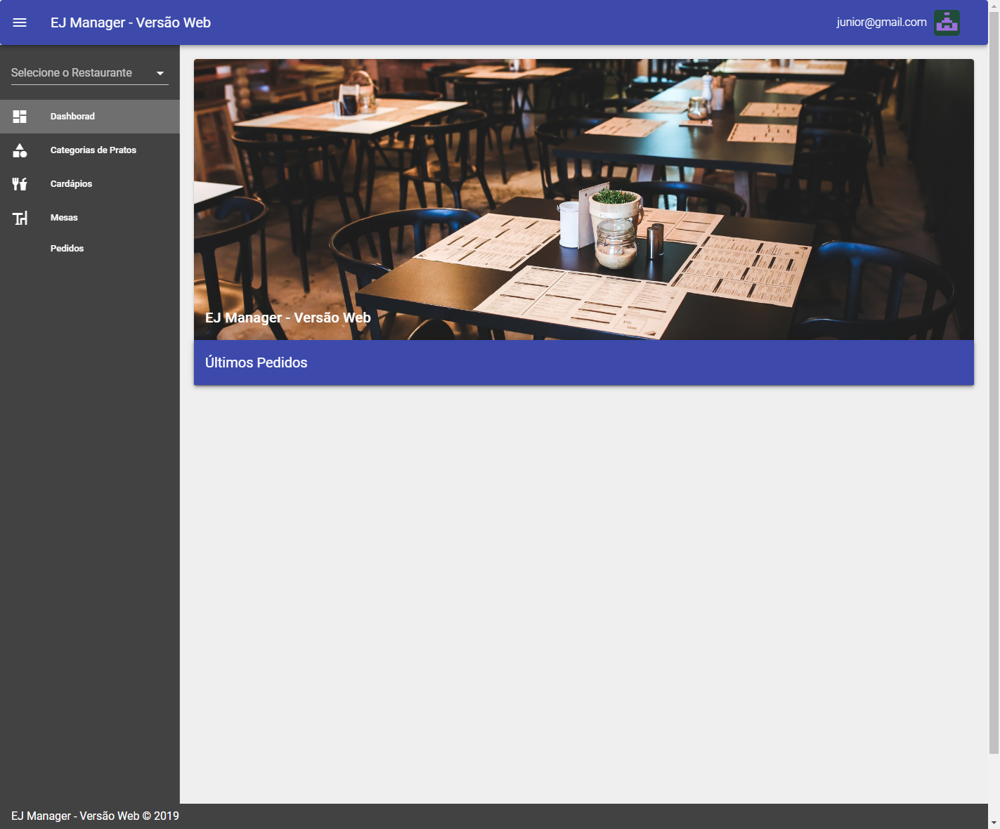
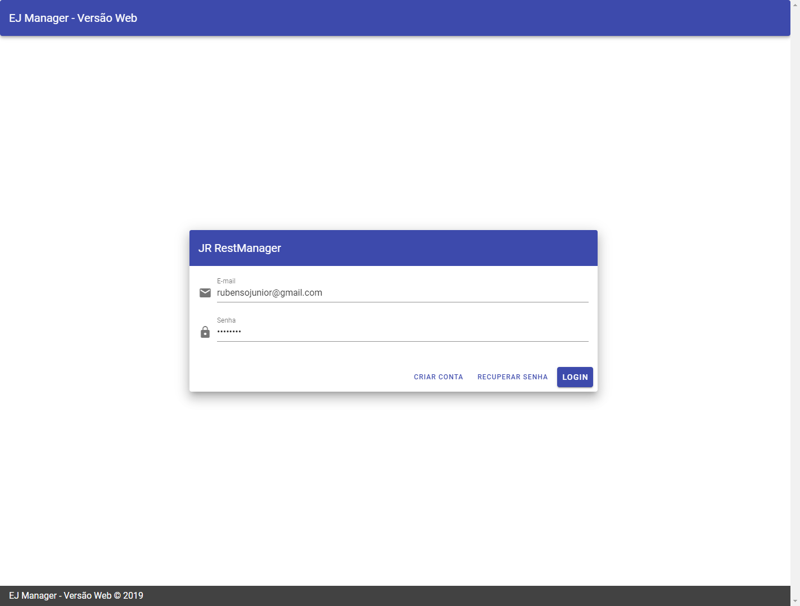

<h1 align="center">
 
X-Restaurant
</h1>

Application for restaurants using Vue.js and Node.

  

  
  

## Features

- Restaurant CRUD.
- Menu CRUD.
- Tables CRUD.
- Add clients order.
- List orders.

## Getting started

  - Inside backend and frontend directoery has getting started.

## License

This project is licensed under the MIT License - see the [LICENSE](https://opensource.org/licenses/MIT) page for details.

---

Created with passion by me 👨🏻‍💻
